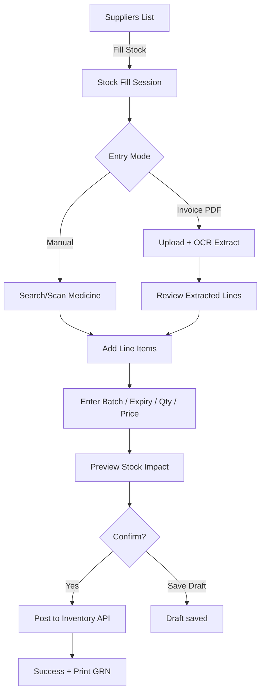

# Medicine Stock Fill — Design Spec (Pharmacist)

## 1. Context in Your Codebase

You already have partial plumbing for this feature:

| What exists | Status |
|---|---|
| Supplier list with **Fill Stock** button | `src/suppliers/pharmacy.tsx` — navigates to `/suppliers/:id/fill-stock` |
| Fill Stock route | **Missing** in `src/App.tsx` |
| Invoice upload (PDF OCR) | `src/suppliers/upload-inovice.tsx` — mock only |
| Manual supplier form | `src/suppliers/add-manual-form.tsx` |
| Tabbed entry (Manual + Invoice) | `src/suppliers/add-pharmacy.tsx` — **not wired** to routes |
| Medicine search API | `GET /medicine/searchMedicine` |
| Stock status UI pattern | `src/prescriptions/prescription-preview.tsx` (In Stock / Low / Out) |
| Pharmacist role | Defined in employees, **not enforced** in routing |

The **Fill Stock** flow is the natural bridge between supplier procurement and the pharmacist's dispensing view.

---

## 2. What Top Pharmacy POS Systems Do (Inspiration)

Patterns from Odoo Pharmacy POS, Norak Pharma, Pharmacy Inventory Pro, and RxFlow-style fulfillment dashboards:

### Core Workflows

1. **Goods Receipt (GRN)** — receive stock against supplier invoice/PO
2. **Batch + expiry tracking** — every stock-in line has batch no., mfg date, expiry
3. **FEFO** — First Expiry, First Out when dispensing
4. **Barcode-first entry** — scan to add lines fast at counter
5. **Invoice OCR** — upload PDF → auto-extract line items → pharmacist verifies
6. **Stock adjustment** — damaged/expired/returned quantities with audit trail
7. **Reorder alerts** — min/max thresholds, low-stock chips
8. **Role-based views** — pharmacist sees receive/verify; admin sees suppliers/POs

### UI Patterns Worth Borrowing

- **Split-pane layout**: left = line items being received, right = invoice/PO summary
- **Inline editable table** — qty, batch, expiry, MRP, purchase price per row
- **Status chips** — draft → verifying → confirmed → posted to inventory
- **Verification checklist** — pharmacist signs off before stock goes live
- **Dense data tables** with sticky header + row-level actions
- **Quick search** with autocomplete (reuse your `SearchMedicines` API)

---

## 3. Design Goals

| Goal | Why |
|---|---|
| Fast data entry | Pharmacists receive 50–200 SKUs per delivery |
| Error prevention | Wrong batch/expiry = patient safety risk |
| Audit trail | Regulatory compliance (who received what, when) |
| Fits existing stack | Ant Design 5, React Router 7, your green `#25D366` theme |
| Two entry modes | Manual (small deliveries) + Invoice upload (bulk) |

---

## 4. User Flow



---

## 5. Screen Design — Fill Stock (`/suppliers/:supplierId/fill-stock`)

### 5.1 Page Header

```
┌─────────────────────────────────────────────────────────────────┐
│  ← Suppliers  /  PharmaLink Distribution  /  Fill Stock         │
│                                                                  │
│  Supplier: PharmaLink Distribution (PL-9920-X)                  │
│  Invoice #: [________]    Date: [date picker]    PO #: [____]   │
│                                                                  │
│  [Manual Entry]  [Upload Invoice]          Status: ● Draft    │
└─────────────────────────────────────────────────────────────────┘
```

Reuse your existing `Tabs` pattern from `add-pharmacy.tsx`.

### 5.2 Manual Entry Tab

**Top bar**

- Medicine search (reuse `SearchMedicines` from `add-prescription.tsx`)
- Barcode input (future: scan → resolve medicine)
- **+ Add Row** button

**Editable line-item table**

| Medicine | Generic / Strength | Batch No. | Expiry | Qty | Unit | MRP | Cost | Actions |
|---|---|---|---|---|---|---|---|---|
| Dolo 650 | Paracetamol 650mg | B-2024-001 | Mar 2027 | 500 | Tab | ₹30 | ₹18 | ✏️ 🗑 |
| Amoxicillin 500mg | Amoxicillin | B-2024-088 | Jan 2026 | 200 | Cap | ₹45 | ₹28 | ✏️ 🗑 |

**Row validation (inline)**

- Expiry must be future
- Qty > 0
- Batch required for scheduled drugs
- Duplicate batch for same medicine → warning

**Footer summary card**

```
┌──────────────────────────────────────┐
│  Lines: 12    Total Units: 4,200    │
│  Invoice Value: ₹84,500              │
│  New SKUs: 2   Updated batches: 10   │
│                                      │
│  [Save Draft]  [Preview Impact]  [Confirm & Post Stock] │
└──────────────────────────────────────┘
```

### 5.3 Invoice Upload Tab

Extend `upload-inovice.tsx`:

1. Drag-drop PDF
2. Progress bar (OCR processing)
3. Extracted table with confidence scores
4. Pharmacist maps/corrects each row
5. **Import to line items** → switches to Manual tab with pre-filled rows

```
┌─────────────────────────────────────────────────────────┐
│  📄 Invoice_inv-2023-001.pdf          OCR: 94% match   │
│  ████████████████████░░░░  85%                          │
│                                                         │
│  Extracted: 15 items  |  2 need review  |  1 unmatched│
│                                                         │
│  [Review & Import]                                      │
└─────────────────────────────────────────────────────────┘
```

### 5.4 Preview Impact Modal (Before Confirm)

Show what will change in inventory:

| Medicine | Current Stock | Adding | New Total | Nearest Expiry |
|---|---|---|---|---|
| Dolo 650 | 4,500 | +500 | 5,000 | Mar 2027 |
| Amoxicillin 500mg | 0 (Out) | +200 | 200 | Jan 2026 |

Use the same stock status chips from `prescription-preview.tsx`:

- Green dot = In Stock
- Amber = Low Stock (below reorder level)
- Red = Out of Stock → will become In Stock after confirm

### 5.5 Post-Confirm

- Success toast
- Optional: print GRN receipt
- Redirect to supplier detail or inventory dashboard
- Audit log entry created

---

## 6. Pharmacist Inventory Dashboard (Optional Phase 2)

A dedicated `/pharmacy/inventory` view for ongoing stock management:

```
┌──────────────┬──────────────┬──────────────┬──────────────┐
│ Total SKUs   │ Low Stock    │ Expiring 30d │ Pending GRN  │
│    1,247     │     23       │     8        │      2       │
└──────────────┴──────────────┴──────────────┴──────────────┘

[Search medicines...]  [Filter: Low Stock ▼]  [Filter: Expiring ▼]

| Medicine | Batch | Expiry | On Hand | Reorder | Status | Action |
```

Actions: Adjust stock, View movement history, Fill from supplier.

### 6.1 Relationship to Clinic Overview (`/dashboard`)

The full inventory table above is the **canonical pharmacy workspace**. The clinic Overview dashboard shows a **compact alert cousin** only — not a duplicate inventory grid.

| Surface | Route | Scope |
|---------|-------|-------|
| Overview pharmacy alerts (`W-INV`) | `/dashboard` | Counts + top 5 low/expiring + pending GRN; CTAs into inventory / fill-stock |
| Inventory dashboard | `/pharmacy/inventory` | Full SKU table, filters, adjust stock, movement history |
| Fill Stock / GRN | `/suppliers/:supplierId/fill-stock` | Receive stock session (this document §§4–5) |

**Product rules (shared with `dashboard-requirements.md`):**

- Show Overview `W-INV` only when `inventory_enabled` (Phase 2).
- Reuse the same stock chips as `src/prescriptions/prescription-preview.tsx`: In Stock / Low / Out.
- KPI definitions must match: Low stock count, Expiring in 30 days, Pending GRN.
- Deep links from Overview: “Open inventory” → `/pharmacy/inventory`; “Fill stock” → suppliers fill-stock flow.
- Pharmacist role: Overview is an alert day board; deep work stays on inventory + GRN screens.

See **[dashboard-requirements.md](dashboard-requirements.md)** §7.8 (Inventory alerts), §7.6 (Quick actions), §11 Phase 2, and DASH-03 Pharmacist layout.

---

## 7. Data Model (Suggested)

```typescript
// Stock Fill Session (GRN)
interface StockFillSession {
  id: string;
  supplier_id: string;
  organisation_id: string;
  invoice_number: string;
  invoice_date: string;
  purchase_order_id?: string;
  status: 'draft' | 'verifying' | 'confirmed' | 'posted' | 'cancelled';
  entry_mode: 'manual' | 'invoice_ocr';
  invoice_file_url?: string;
  received_by: string;        // pharmacist user_id
  confirmed_at?: string;
  lines: StockFillLine[];
  total_value: number;
  notes?: string;
}

interface StockFillLine {
  id: string;
  medicine_id: string;
  medicine_name: string;
  generic_name: string;
  strength: string;
  batch_number: string;
  expiry_date: string;        // ISO date
  quantity: number;
  unit: 'tablet' | 'capsule' | 'ml' | 'vial' | 'strip' | 'bottle';
  mrp: number;
  purchase_price: number;
  free_quantity?: number;       // common in pharma (10+2 scheme)
  ocr_confidence?: number;      // 0-1 if from invoice
  needs_review: boolean;
}

// Inventory batch (posted result)
interface MedicineBatch {
  id: string;
  medicine_id: string;
  batch_number: string;
  expiry_date: string;
  quantity_on_hand: number;
  mrp: number;
  purchase_price: number;
  supplier_id: string;
  grn_id: string;
  received_at: string;
}
```

---

## 8. API Endpoints (Suggested)

| Method | Endpoint | Purpose |
|---|---|---|
| POST | `/stock-fill/sessions` | Create draft session |
| GET | `/stock-fill/sessions/:id` | Get session + lines |
| PUT | `/stock-fill/sessions/:id` | Update header (invoice no, date) |
| POST | `/stock-fill/sessions/:id/lines` | Add line item |
| PUT | `/stock-fill/sessions/:id/lines/:lineId` | Update line |
| DELETE | `/stock-fill/sessions/:id/lines/:lineId` | Remove line |
| POST | `/stock-fill/sessions/:id/upload-invoice` | Upload PDF, trigger OCR |
| GET | `/stock-fill/sessions/:id/preview` | Preview inventory impact |
| POST | `/stock-fill/sessions/:id/confirm` | Post to inventory |
| GET | `/inventory/medicines` | List with stock levels |
| GET | `/inventory/medicines/:id/batches` | Batch-level stock |
| GET | `/inventory/alerts` | Low stock + expiring |

Reuse existing: `GET /medicine/searchMedicine?name=...`

---

## 9. Component Structure (Fits Your Project)

```
src/
  pharmacy/
    stock-fill/
      fill-stock-page.tsx          # Main page (route handler)
      stock-fill-header.tsx        # Supplier info + invoice fields
      stock-fill-tabs.tsx          # Manual | Upload Invoice
      line-items-table.tsx         # Editable Ant Design Table
      add-medicine-row.tsx         # Search + quick add
      invoice-upload-panel.tsx     # Extends upload-inovice.tsx
      ocr-review-table.tsx         # Post-OCR review
      stock-impact-preview.tsx     # Modal before confirm
      stock-fill-summary.tsx       # Footer totals card
      api/
        stock-fill.ts
      types/
        stock-fill.ts
      hooks/
        useStockFillSession.ts     # React Query
```

**Route to add in `App.tsx`:**

```tsx
<Route
  path="/suppliers/:supplierId/fill-stock"
  element={<AuthGuard><FillStockPage /></AuthGuard>}
/>
```

---

## 10. Modern UI Recommendations (Ant Design 5)

### Visual Language

- Keep `#25D366` primary; use semantic colors for stock:
  - Success: `#52c41a` (in stock)
  - Warning: `#faad14` (low / expiring soon)
  - Error: `#ff4d4f` (out of stock / expired)
- Card-based sections with `bordered={false}` and light shadow (like `add-manual-form.tsx`)
- Sticky footer action bar on mobile

### UX Details

- **Keyboard-first**: Tab through batch → expiry → qty
- **Bulk paste**: Excel copy → paste into table (Phase 2)
- **Autosave draft** every 30s (React Query `useMutation` debounced)
- **Popconfirm** on delete line and confirm post (per your audit report)
- **Empty state**: "No items yet — search a medicine or upload an invoice"
- **Loading skeletons** on OCR and preview

### Responsive

- Desktop: full table + side summary
- Tablet: collapsible summary drawer
- Mobile: card list per line item instead of wide table

---

## 11. Role-Based Access

| Role | Can do |
|---|---|
| Pharmacist | Create GRN, verify OCR, confirm stock |
| Admin | All + cancel posted GRN, adjust stock |
| Doctor / Nurse | View inventory only (optional) |
| Receptionist | No access |

Wire this when you extend `AuthGuard` beyond token-only checks.

---

## 12. Implementation Phases

### Phase 1 — MVP (2–3 weeks)

- [ ] Route + Fill Stock page shell
- [ ] Manual line-item table with validation
- [ ] Save draft + confirm APIs
- [ ] Stock impact preview modal
- [ ] Connect existing Fill Stock button in `pharmacy.tsx`

### Phase 2 — Invoice OCR

- [ ] PDF upload + OCR backend
- [ ] Review/import extracted lines
- [ ] Confidence highlighting for low-confidence rows

### Phase 3 — Inventory Dashboard

- [ ] Pharmacist inventory list with filters
- [ ] Low stock / expiry alerts
- [ ] Batch-level drill-down
- [ ] Movement history

### Phase 4 — POS Integration

- [ ] Link stock levels to `prescription-preview.tsx` (replace mock data)
- [ ] FEFO batch selection at dispense time
- [ ] Barcode scanning

---

## 13. Wireframe — Full Page (Desktop)

```
┌──────────┬────────────────────────────────────────────────────────────┐
│          │  Home > Suppliers > PharmaLink > Fill Stock               │
│ Sidebar  ├────────────────────────────────────────────────────────────┤
│          │  ┌─ Supplier Card ─────────────────────────────────────┐  │
│ Dashboard│  │ PharmaLink Distribution  PL-9920-X  ● Active          │  │
│ Patients │  │ Invoice: [INV-2024-089]  Date: [07/07/2026]         │  │
│ Rx       │  └────────────────────────────────────────────────────┘  │
│ Suppliers│                                                            │
│ Employees│  ┌ Manual Entry ─┬─ Upload Invoice ─────────────────┐   │
│          │  │ 🔍 Search medicine or scan barcode    [+ Add Row]  │   │
│          │  ├────────────────────────────────────────────────────┤   │
│          │  │ Medicine    Batch    Expiry   Qty  MRP   Cost  ⚙  │   │
│          │  │ Dolo 650    B-001    Mar'27   500  30    18   🗑 │   │
│          │  │ Ator 20mg   B-044    Jun'26   100  120   85   🗑 │   │
│          │  │ ...                                              │   │
│          │  └────────────────────────────────────────────────────┘   │
│          │                                                            │
│          │  ┌─ Summary ──────────────────────────────────────────┐   │
│          │  │ 2 lines · 600 units · ₹12,400                      │   │
│          │  │         [Save Draft]  [Preview]  [Confirm Stock]   │   │
│          │  └────────────────────────────────────────────────────┘   │
└──────────┴────────────────────────────────────────────────────────────┘
```

---

## 14. Key Design Decisions

| Decision | Recommendation | Rationale |
|---|---|---|
| Entry mode | Tabs: Manual + Invoice | Matches `add-pharmacy.tsx`; covers all delivery types |
| Stock unit | Per batch, not per medicine | Required for expiry/FEFO |
| Confirm step | Mandatory preview modal | Prevents accidental bulk posts |
| Draft autosave | Yes | Long sessions; pharmacist may be interrupted |
| OCR | Verify-before-import | OCR errors are common on invoices |
| Table vs form | Inline editable table | POS standard; faster than modal-per-row |

---

## 15. Connection to Prescription Flow

After stock fill is live, update `prescription-preview.tsx` to:

1. Fetch real stock per medicine from inventory API
2. Show batch-aware availability
3. Block dispense if out of stock (or suggest substitute)
4. Decrement stock on "Dispense" confirm

That turns the mock pharmacist view into a real dispensing workflow.

---

## Summary

The **Medicine Stock Fill** feature should be a **Goods Receipt (GRN)** workflow: pharmacist selects supplier → enters or OCR-imports invoice lines → adds batch/expiry/qty → previews impact → confirms to inventory. It fits your existing suppliers module, reuses medicine search and stock status UI, and aligns with how modern pharmacy POS systems (Odoo, Norak Pharma, Pharmacy Inventory Pro) handle procurement.

**Immediate next step in your repo:** add the missing route `/suppliers/:supplierId/fill-stock` and build `fill-stock-page.tsx` using the patterns from `pharmacy.tsx`, `add-prescription.tsx`, and `upload-inovice.tsx`.
