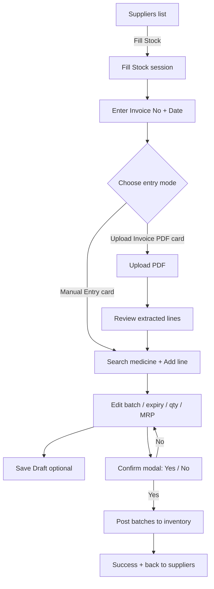

# Medicine Stock Fill — Design Spec (MVP)

## 1. Purpose & Scope

When a user clicks **Fill Stock** on a supplier (`/suppliers/:id/fill-stock`), they open a **Goods Receipt (GRN)** session: identify the supplier invoice, add medicines with batch details, then confirm posting into inventory.

| In scope (v1) | Out of scope (later) |
|---|---|
| Invoice no. + date required on session | Purchase order linking |
| Two entry modes: Manual · Upload Invoice PDF | Full OCR auto-post without review |
| Manual: search medicine → line items | Barcode scan |
| Line fields: batch, expiry, qty, MRP | Free qty schemes (10+2) |
| Derived unit selling price from MRP + pack size | Inventory dashboard / FEFO dispense |
| Confirm Yes/No modal with summary | Stock adjustments / returns |
| Draft save | Role enforcement beyond AuthGuard |

Related: [`prescription-checkout-design.md`](prescription-checkout-design.md) (dispensing uses posted stock later).

---

## 2. Corrected Approach (vs original idea)

### What stays from your proposal

1. **Two mode cards** after opening Fill Stock — Manual Entry vs Upload Invoice PDF  
2. **Invoice number at the top** — required; this is the audit key for “which stock came in on this invoice”  
3. **Manual path** — search medicine → add line → batch, expiry, qty, price  
4. **Confirm popup** before posting to inventory  

### What to correct

| Your idea | Correction | Why |
|---|---|---|
| Price = MRP, and “selling_price from qty × MRP” | Enter **MRP (pack)**. **Unit selling price** = `MRP ÷ pack_size`. Optionally enter **purchase/cost price** from the invoice. | Qty × MRP is a **line total**, not a selling price. Confusing them breaks margin and billed unit price. |
| Unit price = f(qty, MRP) | Unit price = f(**MRP, pack size**). Qty only scales **line total**. | Pack of 10 at MRP ₹30 → unit ₹3.00; qty 500 means 500 units × ₹3 (or 50 packs × ₹30 depending on qty unit — pick one rule and stick to it). |
| Cards only | Cards to **choose mode**, then work inside that mode (with ability to switch). Invoice fields stay visible in both. | Cards alone don’t scale for 20+ lines; editable table does. |
| Bare Yes/No | Confirm modal must show **invoice #, line count, total units, invoice value**. | Accidental post is high risk. |
| Optional invoice no. | **Invoice no. required before Add / Upload**. | Without it you cannot group or audit stock fills. |

### Pricing model (locked for MVP)

```
Pack MRP          → what is printed on the strip/bottle (user enters)
Pack size         → from medicine master (e.g. 10 tabs/strip); show read-only
Unit selling price → MRP ÷ pack_size   (auto, editable override later if needed)
Qty               → number of sellable units being received (tablets/caps/ml)
Line total (MRP)  → unit_selling_price × qty   (display only)

Purchase / cost   → optional in v1, recommended: amount paid to supplier for this line
                    (or per-unit cost). Comes from invoice; used for inventory valuation.
```

**Do not** treat MRP as purchase price. Pharmacies buy below MRP; patients are typically billed at (or near) MRP / unit selling price.

**Example**

| Field | Value |
|---|---|
| Medicine | Dolo 650 |
| Pack size | 15 tablets |
| MRP (pack) | ₹30.00 |
| Unit selling price | ₹2.00 (auto) |
| Qty received | 500 tablets |
| Line MRP value | ₹1,000.00 |
| Purchase cost (optional) | ₹14.00 / pack or ₹700 line |

---

## 3. User Flow



---

## 4. Screen Design

### 4.1 Shared session header (always visible)

```
← Suppliers  /  PharmaLink Distribution  /  Fill Stock

Supplier: PharmaLink Distribution   PL-9920-X   ● Active
Invoice No. * [INV-2026-089]     Invoice Date * [15/07/2026]
Status: Draft
```

- Invoice No. required, unique per org (or per supplier+org).  
- Disable Add / Upload until invoice no. is filled.  
- Show validation if duplicate invoice already posted.

### 4.2 Step 1 — Mode chooser (two cards)

```
How do you want to add stock?

┌──────────────────────────┐  ┌──────────────────────────┐
│  Manual Entry            │  │  Upload Invoice PDF      │
│  Search medicines and    │  │  Upload supplier PDF to  │
│  enter batch, expiry,    │  │  extract line items,     │
│  qty, MRP                │  │  then review & edit      │
└──────────────────────────┘  └──────────────────────────┘
```

Cards are **mode entry**, not persistent marketing tiles. After choice, show a compact mode switcher (segmented control or tabs) so the user can change mode without losing the invoice header.

### 4.3 Manual Entry

**Toolbar**

- Medicine search (reuse `SearchMedicines`)  
- **+ Add line** (adds selected medicine with empty batch/expiry/qty/MRP)

**Line table**

| Medicine | Batch No. * | Expiry * | Qty * | Pack size | MRP (₹) * | Unit price (₹) | Line total | |
|---|---|---|---|---|---|---|---|---|
| Dolo 650 | B-2401 | Mar 2027 | 500 | 15 | 30.00 | 2.00 | ₹1,000 | 🗑 |
| Amox 500 | B-0882 | Jan 2027 | 200 | 10 | 85.00 | 8.50 | ₹1,700 | 🗑 |

- Unit price = read-only computed (MRP ÷ pack size).  
- Pack size from medicine master; if missing, force enter pack size once.  
- Validation: expiry > today, qty > 0, batch required, MRP entered.

**Footer**

```
2 lines · 700 units · Invoice value ₹2,700
[Save Draft]                    [Confirm & Post Stock]
```

### 4.4 Upload Invoice PDF

1. Drag-drop PDF (reuse `upload-inovice.tsx` patterns)  
2. Progress while processing  
3. Review table (same columns as manual) with low-confidence rows highlighted  
4. **Import to lines** → lands on the same editable table as Manual  
5. Pharmacist/supplier user must fix batch/expiry/MRP before confirm  

OCR never posts directly to inventory.

### 4.5 Confirm modal (required)

Not a bare Yes/No — include summary:

```
Confirm stock fill?

Post 2 medicines (700 units) from invoice INV-2026-089
to PharmaLink Distribution inventory?

Invoice value (MRP): ₹2,700

[Cancel]                    [Confirm & Post]
```

On success: toast + navigate back to suppliers (or stay with status Posted).

---

## 5. Wireframes (Desktop)

### Mode chooser

```
┌────────────────────────────────────────────────────────────┐
│ Suppliers > PharmaLink Distribution > Fill Stock          │
│ PharmaLink Distribution  PL-9920-X  ● Active               │
│ Invoice No. [INV-2026-089]   Date [15/07/2026]  Draft     │
│                                                            │
│ How do you want to add stock?                              │
│  ┌─────────────────────┐   ┌─────────────────────┐       │
│  │ Manual Entry        │   │ Upload Invoice PDF  │       │
│  │ Search + line items │   │ PDF → review lines  │       │
│  └─────────────────────┘   └─────────────────────┘       │
└────────────────────────────────────────────────────────────┘
```

### Manual entry + confirm

```
┌────────────────────────────────────────────────────────────┐
│ … invoice header …                                         │
│ [Manual Entry]  Upload Invoice                             │
│ 🔍 Search medicine…                         [+ Add line]   │
│ Medicine   Batch   Expiry   Qty  MRP   Unit   Total   🗑  │
│ Dolo 650   B-2401  Mar’27   500  30    2.00   1000        │
│ …                                                          │
│ 2 lines · 700 units · ₹2,700                               │
│                    [Save Draft]  [Confirm & Post Stock]    │
└────────────────────────────────────────────────────────────┘

          ┌─ Confirm ─────────────────────────┐
          │ Post 2 medicines (700 units)     │
          │ invoice INV-2026-089 ?           │
          │ [Cancel]     [Confirm & Post]    │
          └──────────────────────────────────┘
```

---

## 6. Data Model (MVP)

```typescript
interface StockFillSession {
  id: string;
  supplier_id: string;
  organisation_id: string;
  invoice_number: string;       // required
  invoice_date: string;         // required
  status: 'draft' | 'posted' | 'cancelled';
  entry_mode: 'manual' | 'invoice_ocr';
  invoice_file_url?: string;
  lines: StockFillLine[];
  created_by: string;
  posted_at?: string;
}

interface StockFillLine {
  id: string;
  medicine_id: string;
  medicine_name: string;
  pack_size: number;            // from master
  batch_number: string;
  expiry_date: string;
  quantity: number;             // sellable units
  mrp: number;                  // pack MRP
  unit_selling_price: number;   // mrp / pack_size (stored)
  purchase_price?: number;      // optional cost per unit or pack — decide one
  line_mrp_total: number;       // unit_selling_price * quantity
}
```

After confirm, create `MedicineBatch` rows keyed by `(medicine_id, batch_number, supplier_id, grn_id)` so later dispensing can FEFO-select batches.

---

## 7. API (Suggested)

| Method | Endpoint | Purpose |
|---|---|---|
| POST | `/stock-fill/sessions` | Create draft (invoice no + date + supplier) |
| PUT | `/stock-fill/sessions/:id` | Update header / lines |
| POST | `/stock-fill/sessions/:id/upload-invoice` | PDF upload |
| POST | `/stock-fill/sessions/:id/confirm` | Validate + post inventory |
| GET | `/medicine/searchMedicine` | Existing search |

Confirm rejects if invoice_number already posted for org (or soft-warn).

---

## 8. Component Map

```
src/suppliers/
  fill-stock/
    fill-stock-page.tsx          # Route shell + invoice header
    mode-chooser.tsx             # Two cards
    manual-entry-panel.tsx       # Search + table
    invoice-upload-panel.tsx     # Extends upload-inovice.tsx
    line-items-table.tsx
    confirm-post-modal.tsx
    types/stock-fill.ts
    api/stock-fill.ts
```

Route (missing today):

```tsx
<Route
  path="/suppliers/:supplierId/fill-stock"
  element={<AuthGuard><FillStockPage /></AuthGuard>}
/>
```

`pharmacy.tsx` already navigates to this path.

---

## 9. UI Design Prompt (Copy-Paste)

```
Design a desktop hospital pharmacy “Fill Stock” (goods receipt) screen for a clinical web app.

CONTEXT
- User clicks Fill Stock on a supplier row
- Brand: primary green #25D366, light clinical Ant Design density, Roboto
- Light mode only. No purple gradients, no cream terracotta editorial look, no emoji, no glow, no marketing card clutter

FRAME 1 — Mode chooser
- Breadcrumb: Suppliers / PharmaLink Distribution / Fill Stock
- Compact supplier strip + required Invoice No. + Invoice Date + Draft status
- Headline: How do you want to add stock?
- Two equal interaction cards: Manual Entry | Upload Invoice PDF

FRAME 2 — Manual entry
- Same invoice header sticky
- Segmented control: Manual Entry selected
- Search + Add line
- Table: Medicine, Batch No, Expiry, Qty, MRP ₹, Unit Price ₹ (computed), Line Total, delete
- Helper text: Unit price = MRP ÷ pack size
- Sticky footer: line/unit/value summary + Save Draft + Confirm & Post Stock

FRAME 3 — Confirm modal
- Title: Confirm stock fill?
- Body: Post N medicines (X units) from invoice INV-… ?
- Cancel + Confirm & Post (primary green)

DELIVERABLE: high-fidelity mocks of the three frames. Clinical POS density, not consumer e-commerce.
```

---

## 10. Evaluation Checklist

| Decision | Options | Default |
|---|---|---|
| Mode UI | Cards first vs tabs only | **Cards first, then segmented/tabs** |
| Invoice no. | Optional vs required | **Required before add/upload** |
| Qty unit | Packs vs sellable units | **Sellable units** (tabs/caps); show pack size |
| Pricing inputs | MRP only vs MRP + purchase cost | **MRP required; purchase cost optional in v1** |
| Unit price | Editable vs computed | **Computed from MRP ÷ pack size** |
| Confirm UX | Bare Yes/No vs summary modal | **Summary modal** |
| After post | Stay vs redirect | **Redirect to suppliers + toast** |
| OCR | Auto-post vs review | **Review then same table** |

---

## 11. Implementation Gate

| Step | Status |
|---|---|
| Approach corrected (this doc) | Done |
| UI mocks reviewed | Pending — see generated frames |
| Checklist §10 decided | Pending |
| Build route + FillStockPage | After approval |

---

## Summary

Treat Fill Stock as an **invoice-keyed GRN**: require **invoice number**, choose **Manual** or **Upload PDF**, enter lines with **batch / expiry / qty / pack MRP**, derive **unit selling price = MRP ÷ pack size**, then **confirm with a summary modal** before posting. Do not derive selling price from `qty × MRP` — that product is the line total, not the unit price.
