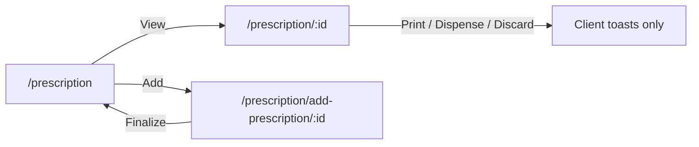
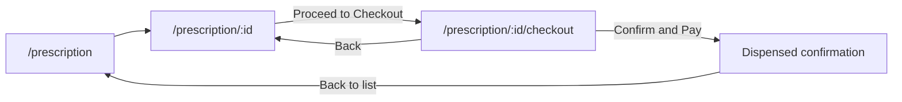
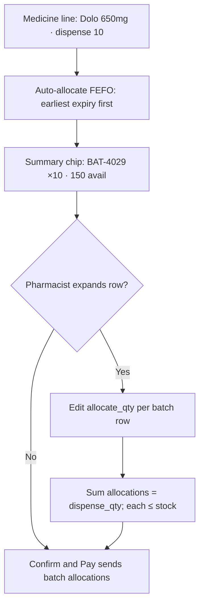

# Prescription Checkout — Design Spec (Pharmacist POS)

## 1. Purpose & Scope

**Checkout** is the pharmacist POS step after clinical review of a prescription: confirm line items and quantities, see a bill, collect payment, then mark the order dispensed.

| In scope (v1 design) | Out of scope (later) |
|---|---|
| Detail → Checkout navigation | Patient self-pay / patient portal |
| Line review with qty / unit price / line total | Barcode scanning |
| Billing summary (subtotal, tax, total) | Gateway refunds / failed-payment ops |
| Payment method (Cash / UPI / Card) | Full partial-dispense lifecycle (remaining balance Rx) |
| Confirm & Pay → dispensed success | |
| Multi-batch FEFO allocation on checkout (expand to override) | |
| Design doc + UI prompt for evaluation | |

This doc is the source of truth for future implementation. **No UI code ships from this doc alone** — evaluate the design prompt output first, then decide what to build.

Related docs:

- [`dashboard-requirements.md`](dashboard-requirements.md) — pharmacist “Rx awaiting dispense”, payments Phase 1
- [`medicine-stock-fill-design.md`](medicine-stock-fill-design.md) — Phase 4 POS / stock link to preview
- [`changes-accepted.md`](changes-accepted.md) — preview footer CTAs currently toast-only

---

## 2. Current State

### Routes & screens

| Screen | Route | File | Role today |
|---|---|---|---|
| Prescription list | `/prescription` | `src/prescriptions/prescription-details.tsx` (`PrescriptionList`) | Search, status filters, View → detail |
| Add / edit Rx | `/prescription/add-prescription/:appointmentID` | `src/prescriptions/add-prescription.tsx` | Doctor create/finalize |
| Prescription detail (pharmacist) | `/prescription/:id` | `src/prescriptions/prescription-preview.tsx` (`PharmacistPrescriptionDetail`) | Load medicines via API; patient card still mock |
| Patient-scoped preview (broken param) | `/patients/prescription-preview/:patientID` | Same preview component | Reads `id`, not `patientID` — likely never loads |

### What detail does today

- Loads medicines with `FindOnePrescription(id)` and maps clinical columns (name, form, schedule, duration, qty).
- Sticky footer actions are **client stubs only**:
  - Print Bill → `window.print()` + toast
  - Generate Labels → fake success toast
  - Discard Order → `Modal.confirm` → warning toast (no API)
  - Partial Dispense → info toast
  - Confirm & Dispense → loading → success toast (no status update, no payment)
- CSS already defines `.billing-summary` / `.summary-row` in `prescription-preview.css`, but **no billing UI is rendered**.

### Data gaps

From `src/prescriptions/types/prescriptionmodel.ts`:

- `medicineResponse` has clinical fields + `quantity` — **no** `unit_price`, tax, or line total.
- `SearchMedicineItem` has no pricing.
- API client (`src/prescriptions/api/prescription.ts`) has create / update / find / status — **no** checkout, payment, or dispense endpoints.
- List status filter type is `"all" | "draft" | "sent"`; UI also colors `dispensed` / `expired` / `pending` but filters do not expose them.

### Flow today



---

## 3. Proposed User Flow



**Happy path**

1. Pharmacist opens a `sent` (awaiting dispense) prescription from the list or dashboard.
2. Detail = clinical review only (medicines, schedule, patient context).
3. Primary CTA: **Proceed to Checkout**.
4. Checkout = commercial step (qty, prices, tax, payment method).
5. **Confirm & Pay** → success state → optional Print Bill → return to list with status `dispensed` (when API exists).

**Secondary paths**

- Back from checkout → detail (no payment recorded).
- Discard on checkout → confirm modal → leave without dispensing (API TBD).
- Print Bill available on success (and optionally on checkout after pay).

---

## 4. Screen Inventory

### 4.1 Detail (existing — light CTA change when implementing)

**Job:** Clinical review. One primary action toward money/dispense.

| Element | Behavior |
|---|---|
| Patient strip | Identity + visit + contact (replace mock when patient API available) |
| Medicine table | Read-only clinical columns (current columns stay) |
| Secondary actions | Print Bill, Generate Labels (keep as secondary) |
| Primary CTA | **Proceed to Checkout** → `/prescription/:id/checkout` |
| Destructive | Discard Order (confirm) — stays on detail or shared |

Do **not** put payment method or editable prices on detail. That is checkout’s job.

### 4.2 Checkout (new)

**Route:** `/prescription/:id/checkout`  
**Suggested files (when implementing):** `src/prescriptions/prescription-checkout.tsx` + `prescription-checkout.css`

| Region | Content |
|---|---|
| Breadcrumb | Prescriptions → Detail → Checkout |
| Patient strip | Live via `getpatientByID` — `patient_id` from list (`?patientId=`) or `getMedicineInfo` |
| Line table | Medicine, form/strength, prescribed qty, **dispense qty** (editable), **unit price**, **line total** |
| Billing summary | Subtotal, tax, **total due** — reuse `.billing-summary` pattern from preview CSS |
| Payment | Segmented: Cash · QR · Link |
| Notes | Optional short note (e.g. “paid at counter”) |
| Sticky footer | Back · Discard · **Confirm & Pay** (primary, brand green) |

**Payment → status rules**

| Method | After Confirm & Pay | How it finishes |
|--------|---------------------|-----------------|
| **Cash** | Popup: confirm cash collected | Pharmacist clicks **Confirm payment** |
| **QR** | Popup: show QR + confirm | Pharmacist clicks **Confirm payment** |
| **Link** | No confirm popup; wait for link | Completes automatically when paid |

**Line rules (v1)**

- Default `dispense_qty` = prescribed `quantity`.
- Line total = `dispense_qty × unit_price` (tax either included in unit price or applied at summary — pick one in evaluation; default below: tax at summary).
- Unchecking a line or setting qty to 0 = omit from bill (light partial dispense without a separate flow).

### 4.3 Success (modal or inline panel)

| Element | Content |
|---|---|
| Title | Order dispensed |
| Body | Rx code, amount paid, payment method, item count |
| Actions | Print Bill · Back to prescriptions |

Prefer a **success modal on the checkout page** for v1 (no extra route) unless evaluation prefers a dedicated receipt page.

---

## 5. UI Layout Brief

Match the existing pharmacist preview: Ant Design 5, Roboto, brand green `#25D366`, CSS variables from `src/index.css` (`--color-primary`, spacing, text tokens).

| Rule | Guidance |
|---|---|
| Composition | One clear checkout composition — not a multi-widget dashboard |
| Density | Clinical / POS density: readable table, sticky footer, no decorative cards in the hero |
| Billing | Right-aligned or below-table summary (240px+), hairline separator before total — existing `.billing-summary` |
| Color | Light clinical UI; avoid purple gradients, cream+terracotta, glow, emoji |
| Motion | Subtle only: footer stickiness, button loading on Confirm & Pay, success modal enter |
| Responsive | Desktop-first (pharmacist counter); stack summary under table on narrow widths |
| Cards | Use existing Card wrappers like preview for patient + table; do not invent a new card system |

---

## 6. Data & API Contracts

### 6.0 Real dispense/checkout line shape (backend)

**Endpoint:** `GET /api/v1/prescription/getMedicineInfo/:prescription_id`  
(`prescription_id` is a **path** param)

Observed response (array of prescription **items**, not a nested medicines list):

```ts
interface DispenseLineResponse {
  prescription_code: string;
  prescription_status: string; // e.g. "sent"
  prescription_created_at: string;
  prescribed_quantity: number;
  prescription_id: string;
  prescription_item_id: string; // UNIQUE line key — not medicine_id
  medicine_id: string;
  medicine_name: string;
  medicine_form: string;
  medicine_strength: string;
  frequency: { morning: number; afternoon: number; night: number };
  reorder_level: number;
  max_stock_target: number;
  medicine_batches: MedicineBatch[];
}

interface MedicineBatch {
  batch_id: string;
  batch_no: string;
  expires_at: string; // YYYY-MM-DD
  current_stock_units: number;
  units_per_box: number;
  pricing: {
    mrp: number;
    unit_price: number;          // cost / internal
    selling_price: number;       // pack / box selling
    unit_selling_price: number;  // per tablet — use for line bill when > 0
  };
  shelf_location: string;
}
```

**Critical rules from this payload**

| Rule | Why |
|---|---|
| Row key = `prescription_item_id` | Same `medicine_id` can appear twice (e.g. Dolo night ×4 and morning ×7) — different schedules = different lines |
| Price from batch | Prefer `unit_selling_price` when &gt; 0; else **`unit_price`**; last resort `selling_price / units_per_box` |
| Decrement per `batch_id` | Stock lives on batches; checkout must submit qty taken from each batch |
| Multiple batches per line | One medicine line can have `medicine_batches.length &gt; 1` — allocate dispense qty across them |

### 6.1 Checkout line (UI model)

```ts
interface CheckoutLineItem {
  key: string; // prescription_item_id
  prescription_item_id: string;
  medicine_id: string;
  medicine_name: string;
  medicine_form: string;
  medicine_strength: string;
  prescribed_qty: number;
  dispense_qty: number;
  unit_price: number; // resolved selling unit price
  selected: boolean;
  batches: CheckoutBatchAllocation[];
}

interface CheckoutBatchAllocation {
  batch_id: string;
  batch_no: string;
  expires_at: string;
  current_stock_units: number;
  shelf_location: string;
  unit_selling_price: number;
  allocate_qty: number; // how many units to take from this batch
}
```

### 6.2 Multi-batch display & decrement (FEFO)

**Default UX: Auto FEFO + expandable override**



**Parent row (always visible)**

- Medicine name · strength · form · frequency hint
- Prescribed qty · editable dispense qty · unit price · line total
- Compact batch summary: `BAT-4029 ×7` or `2 batches · FEFO` when split
- Expand chevron when `medicine_batches.length >= 1`

**Nested batch rows (expanded)**

| Batch | Expiry | On hand | Shelf | Take qty |
|---|---|---|---|---|
| BAT-4029 | 2028-12-31 | 150 | Rack 3-B | InputNumber |
| BAT-5011 | 2027-06-01 | 40 | Rack 3-A | InputNumber |

**Allocation rules**

1. On load / when `dispense_qty` changes: sort batches by `expires_at` ascending (FEFO), fill `allocate_qty` until dispense qty is met.
2. `sum(allocate_qty) === dispense_qty` before Confirm & Pay (block otherwise).
3. Each `allocate_qty <= current_stock_units`.
4. If total stock &lt; dispense qty: clamp dispense, warn, or block pay.
5. Single-batch medicines still show one nested row (transparency) or only the summary chip — prefer summary + expand for density.

**Why not always-flat batch rows?**  
Same medicine can already be 2 parent lines (different `prescription_item_id`). Flattening every batch would explode the table. Nested FEFO keeps one commercial line per prescription item.

### 6.3 Checkout submit (write — batch-aware)

```ts
interface PrescriptionCheckoutPayload {
  prescription_id: string;
  payment_method: "cash" | "qr" | "link";
  status_update?: "manual" | "automatic";
  amount_paid: number;
  notes?: string;
  items: Array<{
    prescription_item_id: string;
    medicine_id: string;
    dispense_qty: number;
    unit_price: number;
    line_subtotal: number;
    batches: Array<{
      batch_id: string;
      allocate_qty: number;
    }>;
  }>;
}
```

Backend decrements `current_stock_units` per `batch_id` from these allocations.

### 6.4 Status

- Entry: `prescription_status === "sent"`.
- On success: `dispensed` (or partial status if product adds it later).
- Prefer `POST /prescription/checkout` (or dispense) with the payload above.

### 6.5 Mock / current UI gap

- Checkout page today uses mock unit prices and no batch nested UI.
- Next build step: map this API array → `CheckoutLineItem` with FEFO auto-allocation + expandable batch table; key rows by `prescription_item_id`.

---

## 7. Wiring Plan (When Implementing)

Do not implement in the design-doc step. When approved:

1. **Route** in `src/App.tsx`:

   ```tsx
   <Route
     path="/prescription/:id/checkout"
     element={<AuthGuard><PrescriptionCheckout /></AuthGuard>}
   />
   ```

   Place **before** or ensure specificity so `/prescription/:id` does not swallow `checkout` (static segment `checkout` under `:id` is fine as a child path: `/prescription/:id/checkout`).

2. **Detail CTA** in `prescription-preview.tsx`:

   ```ts
   navigate(`/prescription/${id}/checkout`);
   ```

   Replace primary **Confirm & Dispense** with **Proceed to Checkout** (or keep Confirm only on checkout).

3. **New component** `src/prescriptions/prescription-checkout.tsx` (+ CSS).

4. **Load dispense lines** from the batch-aware API; map into `CheckoutLineItem` with FEFO allocation (§6.2).

5. **Footer on detail:** Print / Labels remain; Discard stays; remove or demote in-place Confirm & Dispense so money collection is not skipped.

6. **List / dashboard:** no change required for v1 beyond existing links into detail; checkout is always via detail.

---

## 8. Evaluation Checklist

Use design-prompt output (and this doc) to decide what to take into implementation:

| Decision | Options to judge | Default if undecided |
|---|---|---|
| Checkout placement | Separate page vs panel on detail | **Separate page** `/prescription/:id/checkout` |
| Payment methods | Cash / QR / Link | **Cash · QR · Link** (Cash/QR manual confirm; Link auto status) |
| Tax display | Inclusive prices vs subtotal + tax | **Subtotal + tax + total** |
| Partial qty | Qty edit / line toggle vs dedicated flow | **Qty edit + line toggle on checkout** |
| Multi-batch UI | Auto FEFO + expand vs always nested vs allocate modal | **Auto FEFO + expandable override** |
| Line identity | `medicine_id` vs `prescription_item_id` | **`prescription_item_id`** (same medicine can be 2 lines) |
| Success UX | Modal vs dedicated receipt route | **Modal on checkout** |
| Print Bill | Checkout only / success only / both | **Success + optional checkout after pay** |
| Pricing source | Mock map vs batch `unit_selling_price` | **Batch pricing from API** |
| Confirm label | “Confirm & Pay” vs “Confirm & Dispense” | **Confirm & Pay** (dispense implied) |

Mark each row after reviewing mocks; then convert this doc’s “when implementing” section into a concrete build plan.

---

## 9. UI Design Prompt (Copy-Paste)

Use the block below in a design tool, image model, or Cursor UI generation. Evaluate results against §5 and §8 before writing React.

```
Design a desktop hospital pharmacy POS “Prescription Checkout” screen for a clinical web app (not a consumer e-commerce cart).

CONTEXT
- User: pharmacist at a hospital counter
- Flow: they already reviewed the prescription on a detail page; this screen is pay + confirm dispense
- Brand: primary green #25D366, hover #20b858, light clinical UI, Roboto / clean sans-serif
- Look: Ant Design–like density (8px radius, clear tables, sticky footer). Light mode only.
- Avoid: purple/indigo gradients, cream terracotta editorial look, broadsheet newspaper layout, neon glow, emoji, dark mode, floating promo badges, card-heavy marketing layouts

LAYOUT (single composition, desktop 1440×900)
1) Top: breadcrumb — Prescriptions / Prescription Detail / Checkout
2) Compact patient strip (not a hero): avatar, patient name, UHID, age/sex, visit type tag (e.g. Out-Patient), contact phone. Same visual weight as a hospital EMR header strip.
3) Main: “Order items” table with columns:
   - Medicine name + small secondary line (form/strength or food instruction)
   - Prescribed qty (read-only)
   - Dispense qty (editable stepper or input)
   - Unit price (currency, e.g. ₹)
   - Line total
   Optional checkbox column to include/exclude a line
   Show 4–5 realistic Indian generic medicine rows (e.g. Amoxicillin 500mg, Paracetamol 650mg, etc.)
4) Below or right of table: billing summary block (~240px wide, right-aligned):
   - Subtotal
   - Tax (5%)
   - Total due (emphasized, top border separator)
5) Payment method: segmented control or radio group — Cash | UPI | Card. Cash selected.
6) Optional one-line notes field
7) Sticky bottom footer bar:
   - Left: Back
   - Right: Discard (danger text button) + primary green button “Confirm & Pay” with check icon

VISUAL RULES
- One job: checkout. No KPI strips, no sidebar widgets, no marketing stats
- White / soft gray page background with subtle separation; no flat empty void and no heavy gradients
- Table is the visual anchor; billing summary is secondary
- Generous but clinical spacing; sticky footer clearly separated with light top border/shadow
- Show currency as ₹ Indian Rupees
- Include a second optional frame or annotation for mobile/narrow: table stacks, summary full width under table, footer buttons wrap

DELIVERABLE
- High-fidelity UI mock of the checkout page
- Optional small inset: success modal after pay (“Order dispensed”, amount, payment method, Print Bill + Back to list)
- No code; visual design only
```

### Shorter variant (if the tool has a prompt length limit)

```
Hospital pharmacy POS checkout UI, desktop, light clinical Ant Design style, brand green #25D366, Roboto. Breadcrumb, compact patient strip, medicine order table (name, prescribed qty, editable dispense qty, unit price ₹, line total), right billing summary (subtotal, 5% tax, total), Cash/UPI/Card payment, sticky footer Back / Discard / Confirm & Pay. No purple, no cream terracotta, no glow, no emoji, no dashboard widgets. Optional success modal: Order dispensed + Print Bill.
```

---

## 10. Implementation Gate

| Step | Owner | Status |
|---|---|---|
| Design doc written | Engineering | Done (this file) |
| Run UI prompt / review mocks | Product + Engineering | Pending |
| Fill §8 evaluation checklist | Product + Engineering | Pending |
| Implementation plan (files, mock vs API) | Engineering | After evaluation |
| Build checkout UI + wire from detail | Engineering | After plan approval |

---

## 11. File Map (Future)

| Path | Change |
|---|---|
| `src/App.tsx` | Add `/prescription/:id/checkout` route |
| `src/prescriptions/prescription-preview.tsx` | Primary CTA → navigate to checkout |
| `src/prescriptions/prescription-checkout.tsx` | New checkout page |
| `src/prescriptions/prescription-checkout.css` | Checkout styles; reuse billing-summary patterns |
| `src/prescriptions/types/prescriptionmodel.ts` | Add checkout types when wiring |
| `src/prescriptions/api/prescription.ts` | Add checkout/dispense API when backend ready |
| `prescription-checkout-design.md` | This spec (update after evaluation decisions) |
